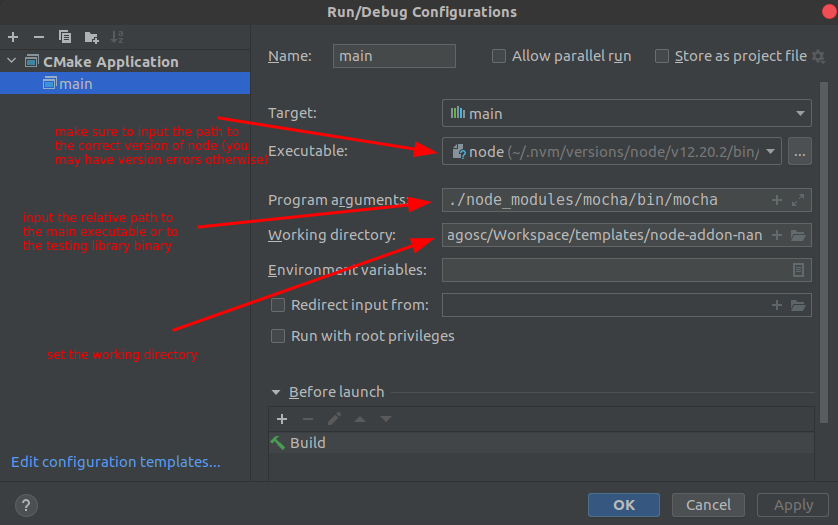

# Configuring CLion for developing a NodeJs C++ Addon 

> [IntelliJ CLion](https://www.jetbrains.com/clion/) is one of the most powerful commercial C++ IDEs in the market. It costs roughly 100$/year (the price drops each year after that) and I actually couldn't live without it. 

<!-- TOC -->

- [Configuring CLion for developing a NodeJs C++ Addon](#configuring-clion-for-developing-a-nodejs-c-addon)
  - [Generic](#generic)
  - [NodeJs (Npm) Configuration](#nodejs-npm-configuration)
  - [Add Node Configuration](#add-node-configuration)
  - [Configure Running Options](#configure-running-options)
  - [Adding "Before Launch" Option ("npm run build")](#adding-before-launch-option-npm-run-build)
  - [Configuring "npm run build".](#configuring-npm-run-build)
  - [Conclusions](#conclusions)
  - [CMake Configuration](#cmake-configuration)
  - [Open Project Wizzard](#open-project-wizzard)
    - [Windows Visual Studio Configuration](#windows-visual-studio-configuration)
  - [Run/Debug Configuration](#rundebug-configuration)

<!-- /TOC -->

## Generic

> First open the dropdown menu near the run button in the top right of the IDE, and click on **Edit Configurations...** option.

## NodeJs (Npm) Configuration

> Since, most modules in this world are configured with `node-gyp`, we feel it's important to start with this configuration and move to the `cmake` one after.

## Add Node Configuration

First, click on the **+** (plus) icon in the top left of the new opened window, and select **npm**. This will start the wizzard for creating a new **npm** driven application.

## Configure Running Options

A new window will appear, which will allow you to configure the node running script

Please fill in will the following values:
* Command: (keep it to) *run*
* Scripts: *test* (the `test` script defined in pacakge.json)
* Node interpreter: *path to node* (in our screenshot we use `nvm`, so the path is different than a normal node install)
* Package manager: *npm* (can be any other that you use, we still use `npm` as default) 

## Adding "Before Launch" Option ("npm run build")

Unfortunately, this is not the last step. In order to be able to compile the C++ code before running the test suite (as configured above), you'll have to configure a **Before Launch** command (script). To do that, please click on the **+** (plus icon) and select **Run npm script**

## Configuring "npm run build".

Yet another window will appear for configuring this new "before launch" script.

Please fill in will the following values:
* Command: *run*
* Scripts: *build:dev* (`build:dev` will allow you to also debug your code;if you do not wish yo debug, you can also use `build` script)
* Node interpreter: *path to node* (in our screenshot we use nvm)
* Package manager: *npm* or any other package manager

## Conclusions

Using this configuration, you will be able to build and run the unit tests for the new addon. We leave it on you, to discover how to run a single test (hint: *Arguments:*)

## CMake Configuration

> Since, CLion is a C++ ide, and the main build system that's integrated into it, is CMake, we will continue first with the CMake one.

For this, a [CMakeLists.txt](../CMakeLists.tst) can be generated by running the following configuration command `node .scripts/clion-config.js -e clion <...other args>`, while the `CMakeLists.txt` template is found under [.scripts/configure/CMakeLists.txt.twig](../.scripts/configure/CMakeLists.txt.twig) (make sure to change the template and run the config command again, otherwise pre-commit hook will reset all your changes).

## Open Project Wizzard

When opening the project, during the **Open Project Wizzard** process, please set the `Build directory` to `build` as shown in the image bellow. 

This will enable nodejs to properly read the compiled libraries.

> In order to be able to debug, also fill in the *CMake Options:* field with **-DCMAKE_BUILD_TYPE=Debug**. This will trigger the build in debug mode, and allow you debug your C++ code.

### Windows Visual Studio Configuration

For Windows, CLion uses as generator for CMake `CodeBlocks - NMake Makefiles` by default which is not the one `cmake-js` will choose.

In my case `cmake-js` chose `Visual Studio 16 2019` as generator, so you will also need to set the CMake generator, by adding something like `-G "Visual Studio 16 2019"` in the `CMake Options` field.

## Run/Debug Configuration

After opening the project, please amend the **Run/Debug Configuration** as follows:

1. `Executable` must be the path to *node* binary. Please make sure you're setting the correct and proper node binary path. If you're using *nvm* please make sure you're setting the path to the proper version of node, otherwise you will encounter version errors.
2. For the `Program arguments` you can use either a path to 
   * the `main` file as set in the `package.json` or 
   * the path to `mocha` or `jest` binaries in order to run & debug tests
3. For the `Working directory` I recommend using the path to the project folder, since that's the place for any possible data or libaries that you will require during the run/debug sessions.

